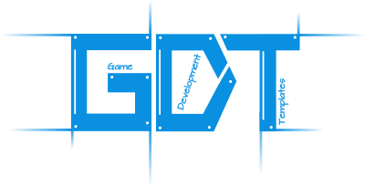

The C++ Game Development Templates Library
==========================================

What is it?
-----------

The Game Development Templates (GDT) is a minimal game 
development toolkit written mostly as a set of generic modern C++ templates.

Built for freedom
~~~~~~~~~~~~~~~~~

GDT is designed to allow easy switching between different libraries for 
graphics, audio physics and other game backends.
While still being work-in-progress, GDT currently supports GLFW or SDL, OpenGL,
OpenAL and Bullet, physics. Vulkan and Newton support is coming soon, followed
by the yet to be chosen network backends.

Here's how you specify a GDT application with a set of changable backends:

::

    using my_game = gdt::application<
        gdt::platform::sdl::backend_for_opengl,
        gdt::graphics::opengl::backend,
        gdt::audio::openal::backend,
        gdt::physics::bullet::backend,
        gdt::no_networking,
        gdt::context
    >;

Soon you would be able to change this set completely,
**without changing other parts of your game code**.

Built for coding
~~~~~~~~~~~~~~~~

In GDT, your C++ code is your main game modeling environment.
Any other tools are considered peripherial. You will use standard C++
constructs to model your game assets, materials, scenes and animations.
You choose your editor or IDE, you choose your project structure and 
everything is visible and controllable:

::

    struct zombie {
        my_game::model model;
        my_game::shader::material material;
        my_game::animation walk,
                           attack,
                           die;
    };

GDT also prefers structuring things in compile time rather than runtime.
This is done through using templates, static polymorphism, CRTP and other nasty
tricks. The general idea is that it's faster to parse through a compiler's error
message (even ones involving templates) than debugging a misbehavior in runtime.

Built for tomorrow
~~~~~~~~~~~~~~~~~~
GDT is using modern C++, applying smart (cough, arsed, cough..) techniques where it makes sense,
while holding back from over-using the language where it isn't.

Built for you
~~~~~~~~~~~~~

GDT prefers your code readability on the expense of its inner complexity.
Game developers should be able to read their code easily, without parsing
through forced and obscured code constructs. GDT tries to follow this guideline
as much as possible.

For example, here's how you use a shader pipeline to render stuff:

::
    
    deferred_shader.use(ctx)
        .set_pov(_camera)
        .set_lights(_lights_rig)
        .draw(_graveyard)
        .draw(_zombie)
        .draw(_hero);

Call for help
-------------

GDT is far from being ready. It needs people like you who
share the vision of having templates-based C++ game engine and who can
submit pull requests with cool new features, sample code or documentation
improvements. No contribution is too small!

.. toctree::
   :hidden:

   application
   context
   scenes
   drawing
   control
   shaders
   text
   renderers
   animation
   physics
   audio
   blueprints
   debug
   example_empty_app
   example_basic_rendering
   example_skeletal_animation
   example_physics_instancing

